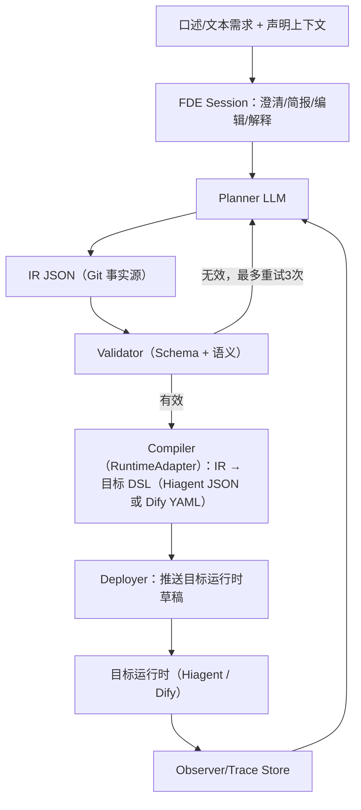
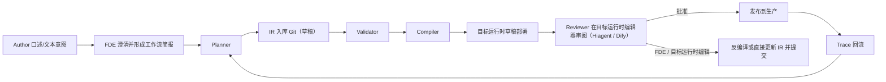

# FDE — AI 驻场流程工程师 PRD v0.4（中文版本）

*（旧工作名：Loom。当前产品名与方向：**FDE = Forward-Deployed Engineer**，中文表述为 **AI 驻场流程工程师**。在本项目中，FDE 不解释为 Front-End Development Engineer。实现包名可暂时保留 `loom/`，但产品叙事、PRD、设计文档、路线图均以 FDE 为准。）*

### 变更记录：v0.3 → v0.4

本版将产品从"工作流 IR/编译器工具"重新定位为"AI 驻场流程工程师"。用户感知的核心不是"我调用一个编译器"，而是"我口述业务流程，FDE 像驻场工程师一样追问、搭建、修改、验证，并把结果推到 **Hiagent / Dify** 等运行时成为可审查草稿"。

- **§1, §2**：FDE 成为产品主叙事；IR、Validator、Compiler、Reverse Compiler 退到内部可信机制。
- **§3**：新增 FDE 角色与能力模型，要求产品像工程师一样完成需求澄清、创建、编辑、解释、交接。
- **§4, §6**：在 Planner 前增加 FDE Session 层，支持口述式/文本式创建与编辑闭环。
- **§7**：Phase 1 不再只交付 JSON request → IR → DSL，而必须交付最小可用 FDE 创建/编辑循环。
- **§10**：增加 FDE 专属指标：澄清轮数、自然语言编辑成功率、口述到草稿时间、用户是否愿意先问 FDE 而非真人工程师。
- **§11**：命名问题确定为 FDE，剩余工作是商标、域名、包名与中文市场歧义核查。
- **中国市场切入**：首个 SOW / 伙伴假设改为"跨境电商主线、中医诊所辅线"。财务/审计、知识产权代理不作为当前主赛道。

### 历史变更记录：v0.2 → v0.3

在 Plan Review（Codex）与市场/设计复盘（Gemini）后完成补丁。总体变化：强化 IR↔Dify 边界契约、将治理价值提升为第一叙事，并把 Phase 2 拆分得更诚实可落地。

- **§1, §2**：补充治理优先叙事（效率是诱因，治理才是买单点），增加“AI 工作流的 Terraform”类比。
- **§3**：明确 Author/Reviewer 是角色，不一定是不同人员；即使同一人兼任，也通过发布权限与审计追踪实现能力边界。
- **§5**：所有节点新增 `rationale` 字段；补齐 IR 类型规则（可空/可选、分支收窄、循环项类型、并行合并类型）；“agentic islands”更名为“bounded agent zones”。
- **§6**：漂移检测从“DSL 字节哈希”改为**规范化 Dify AST 哈希**；反编译等价判定改为“规范化 IR 相等”，而非字面相等。
- **§7**：**Phase 1 从 Day 1 起就跑双运行时（Hiagent 主线 + Dify 副线）**——通过 RuntimeAdapter 抽象（原本 Phase 3.1 的工作前移）。**Phase 1.5** 把双运行时的 forward compiler 都扩到 3 个 TCM 影子 archetype；reverse 在两个电商 deep-coverage archetype 上保持窄覆盖。**n8n 已从 v1 范围移除**（决策日 2026-05-06）；运行时可移植性由 Phase 1 双运行时构造证明。**Phase 3.2**（原 n8n GA）改为可选 LangGraph alpha。Phase 2 仍拆为 2A（承重基础设施）+ 2B（UI / RBAC / Trace / 全量反编译）。**Persona Brief**（用户/角色定位）作为 FDE Session 的第一步加入（在 Workflow Brief 之前），让系统 persona 无关、不锁定垂直。
- **§9**：新增 IR 版本迁移、提示词/工具描述注入、代码节点沙箱逃逸、Trace PII 留存、Trace 存储成本、一致性测试波动等风险。
- **§10**：失败分类从 Planner 扩展到全链路（编译、部署、运行时一致性、反编译、注册表/ACL、人审拒绝）。
- **§11**：Q1/Q2/Q3/Q5/Q6 不再作为外部硬阻塞等待，改为 Phase 0 默认决策：SOW / 需求输入契约、Hiagent Cloud + Dify Cloud（API `v1`）双 pin、凭证绑定策略、反编译默认边界、Agent / LLM 默认设置（`max_output_tokens = 8000`）。
- **2026-05-07 修订**：运行时部署模式从 self-hosted-docker 切到 cloud SaaS。两个运行时都走云端，本地 docker 脚手架（`docker/`、`scripts/{dify,hiagent}_{up,down}.sh`）已删；endpoint + auth token 通过 `config/runtimes.yaml` 配置（模板：`config/runtimes.example.yaml`）。

## 1. 产品主张（Pitch）

FDE 是一个 **AI 驻场流程工程师**。用户像对身边工程师口述一样描述业务流程；FDE 先解析 Persona Brief（角色 / 垂直 / 终端用户 / Reviewer / 合规边界），再追问缺失信息、形成工作流简报、生成可校验 IR、**同时编译为 Hiagent + Dify 草稿（Hiagent 主、Dify 副）**、接受自然语言修改，并把所有改动同步回 Git 中的事实源。

用户侧承诺不是”生成一个 IR 文件”，而是：**口述需求，FDE 帮你搭好、改好、验证好，并交接到 Hiagent / Dify 这类运行时供人审阅。**

内部机制仍然是确定性工作流编译链：LLM 的职责从”运行时执行”迁移到”编译时创作”，先产出可校验的 IR，再由确定性编译器**同时**转为 Hiagent 工作流 JSON 和 Dify DSL（Phase 1 双运行时）。人类在目标运行时可视化编辑器中审阅并发布。Agent 不会消失，而是被约束在**有边界的 Agent 区域**内，通过类型化 I/O、工具作用域与预算上限控制不确定性。n8n 已从 v1 范围移除（2026-05-06）；LangGraph alpha 在 Phase 3.2 视预算决定。

核心论点：**创作用 agentic，生产用 deterministic。**

最短用户表述：**AI 驻场流程工程师。**

最短技术表述：**AI 工作流领域的 Terraform。**

中国市场首个切入点不是泛企业平台，而是**跨境电商运营工作流**：多语言客服问答、订单异常分诊、商品内容本地化、售后升级、经营日报（DAU/GMV/退货率）等高频半结构化流程。中医诊所运营作为辅线与影子语料，用来验证 FDE 是否能跨垂直迁移到问诊前资料收集、复诊随访、知识库问答、客服分诊与经营摘要等流程。在中医影子场景下，FDE 不替代医生诊断、处方或合规审查；它交付的是可审查、可回滚、可交接的业务工作流草稿。

中国市场设计详见 `docs/design/fde-ecommerce-tcm.zh-CN.md`。

## 2. 问题与目标

### 2.1 问题

纯运行时 Agent Harness（如 OpenHands、ReAct 循环）探索能力强，但企业生产场景中常见问题是路径不确定、成本失控、审计薄弱、权限不透明、失败恢复粗糙。可视化工作流平台（Hiagent、Dify、Coze）能解决部分问题，但仍依赖人工搭流。

真实缺口不是“缺一个 DSL 生成器”，而是“缺一个懂业务、懂运行时、懂治理的驻场工程师”。FDE 要补的就是这个角色：用户口述业务目标，FDE 将其落成可审查、可回滚、可审计的工作流草稿。

### 2.2 v1 目标结果（Outcomes）

**治理是第一结果，效率是使用驱动力。**

- **治理/审计**：组织内每个 LLM 工作流都有 Git 单一事实源，并与运行态建立严格漂移契约。
- **FDE 协作闭环**：用户用自然语言描述需求、回答澄清问题、继续用自然语言要求修改；FDE 将协作过程转成运行时草稿与事实源 IR。
- **运行前校验**：在 IR 阶段拦截幻觉工具引用、变量断链、类型错流、预算违规等问题。
- **有边界 Agent 区域**：将不可预测行为收敛在可类型化、可预算化、可回退的节点内。
- **交付效率**：典型工作流从“天级”下降到“<1 小时”。
- **低门槛 Author**：非工程作者也能产出可上线草稿；最终发布仍需 Reviewer 审批。
- **高效 Reviewer**：审批从“手工构建数小时”降到“<5 分钟”。
- **可移植性**：IR 与运行时解耦；v1 同时支持 Hiagent + Dify（通过 RuntimeAdapter 抽象，Phase 1 起跑双运行时）。

### 2.3 v1 交付物（Outputs）

- 自然语言意图 + 上下文声明（工具/数据集/约束）→ 可在目标运行时（Hiagent / Dify）执行的工作流。
- 自然语言修改指令 + 当前工作流状态 → 更新后的 IR 与同一目标运行时上的草稿。
- 需求澄清循环：缺触发器、数据源、凭证、审批策略、输出结构时先问清楚，不靠模型猜。
- 运行前 IR 校验与语义校验。
- 有边界 Agent 子任务的一等节点类型。
- 每个工作流都拥有 Git 中可语义 diff 的 IR 文件。
- “草稿 → 目标运行时审阅 → 审批 → 部署”闭环（每个注册的运行时独立闭环）。

### 2.4 非目标（Non-goals）

- v1 在 Hiagent + Dify 之外不做其他运行时正式产品化（LangGraph alpha 仅在 Phase 3.2 视预算决定；Temporal/n8n 不做）。
- 不重造运行时或可视化编辑器。
- 不替代探索型 Agent。
- 不追求覆盖任一运行时（Hiagent / Dify）的全部节点类型；IR 是契约，不是 Hiagent / Dify 节点的并集。
- 不做医疗诊断、处方建议、疗效承诺或任何绕过医生/合规人员的人审发布。

## 3. 用户与首要用例

三类角色：

- **Author / Requester**：诊所运营、电商运营、分析师、运维工程师、初中级开发，通过自然语言描述需求、选择作用域，并回答 FDE 的澄清问题。
- **FDE**：AI 驻场流程工程师，负责需求澄清（Persona Brief + Workflow Brief）、创建 IR、校验、编译、通过 RuntimeAdapter 推送目标运行时草稿、接受编辑指令、生成评审摘要、保持事实源同步。
- **Reviewer**：资深工程师、SRE、安全角色，在目标运行时编辑器（Hiagent 或 Dify）中审阅与批准。
- **Operator/End User**：运行已发布工作流。

买方画像分两层：

- **中国首个 SOW / 伙伴假设**：跨境电商品牌方/卖家（Amazon、Shopify、TikTok Shop、Shein、Temu 渠道为主）、电商 SaaS / 3PL 集成商、品牌运营服务商。预算来自多语言客服标准化、订单异常吞吐、Listing 本地化、售后 SLA、客户 PII 处理与可审计的代理工作流变更控制。中医连锁诊所、诊所管理 SaaS/系统集成商、医疗健康运营服务商作为次级伙伴位（影子语料），承担同一治理叙事在医疗运营场景的迁移验证；不强制要求首期就拿下。
- **后续技术买方**：200–2000 人技术公司的 Engineering Platform / AI Ops 团队，预算来自“治理与安全护栏”。

初始 5 类用例（Phase 0 需用 SOW 候选工作流验证或替换；SOW 可真实也可合成）。主线为跨境电商；archetype 02–04 保留为中医影子流程作为跨垂直可迁移性检查：

1. **跨境电商客户 FAQ / KB 问答**：买家多语言提问 → 从商品/政策知识库回答（带来源） → 低置信触发升级 → 渠道差异化语气（Amazon、Shopify、TikTok Shop、Shein、Temu）。
2. **中医问诊前资料收集与分诊** *(影子)*：患者口述/表单信息 → 结构化摘要 → 人工复核队列。
3. **诊所经营 ETL + 摘要** *(影子)*：预约、复诊、客服、库存/药房数据 → 日报/周报 → 负责人确认。
4. **复诊与疗程随访** *(影子)*：按疗程/时间触发随访 → 异常信号升级 → 记录回写。
5. **跨境电商订单异常分诊**：订单/物流/退货异常 → 多语言客户回复 + 运营队列路由 + 退款/补发流程，影响 SLA 时需经理审批。

### 3.1 FDE 能力模型

FDE 必须按"角色能力"验收，而不是只按"是否能编译"验收：

1. **Persona 解析**：在追问工作流细节之前，先从 per-tenant Persona registry 解析 Persona Brief（角色 / 垂直 / 终端用户 / Reviewer / 合规边界）。没有这步，FDE 退化为锁定垂直的工具。
2. **需求捕获**：把口述需求整理成结构化工作流简报；缺触发器、数据源、凭证、策略、输出时主动追问。追问范围受 Persona Brief 约束。
3. **工作流创建**：生成有效 IR，编译到所选运行时（v1: Hiagent 主 / Dify 副）的锁定版本，并推送草稿。
4. **工作流编辑**：理解"把召回数量从 20 改成 15""失败先重试两次""高风险结果转人工复核"等自然语言编辑；在同一运行时上更新 IR 与草稿。
5. **评审支持**：用 Reviewer 能理解的话解释新增节点、删除节点、凭证变化、策略变化、Agent 预算变化、合规边界变化与安全影响。
6. **治理保全**：不允许只改运行时草稿而丢失事实源；所有识别内修改必须回写 IR，识别外修改必须硬阻塞并给修复路径。
7. **运行时交接**：最终留下的是目标运行时中的可审查草稿，而不是一段一次性 Agent 对话。

## 4. 架构



三项架构承诺：

- **IR 是契约**：上游产 IR，下游消费 IR，编译器/校验器/部署器不调用 LLM。
- **Planner 可替换**：模型可替换，IR 不变。
- **运行时可替换**：新增编译目标是增量工程，不是系统重写。

## 5. IR（中间表示）

IR 是核心设计产物：保持小而强、显式版本化、强校验。

### 5.1 顶层结构（示意）

```json
{
  "ir_version": "0.3",
  "metadata": {
    "name": "...",
    "description": "...",
    "owner": "...",
    "rationale": "..."
  },
  "registry_ref": {
    "registry_version": "sha:b7c3d2e",
    "tools": ["web_search", "fetch_url"],
    "datasets": ["product_kb", "policy_kb"],
    "credentials": ["shopify_api", "amazon_sp_api", "wechat_work_api"]
  },
  "policy": {
    "default_timeout_s": 60,
    "default_retry": { "max_attempts": 3, "backoff": "exponential" },
    "agent_budget": { "max_iterations": 10, "max_tokens": 50000, "max_wall_clock_s": 300 }
  },
  "nodes": [],
  "edges": []
}
```

关键点：

- `rationale` 为 v0.3 强制字段，供评审理解“为什么有这个节点”。
- `registry_ref.registry_version` 使用不可变 SHA，避免“latest 漂移”。
- `policy` 提供工作流级超时/重试/预算默认值，节点仅可收紧不可放宽。

### 5.2 v1 节点类型

- `trigger`
- `llm`
- `retrieval`
- `http`
- `code`
- `condition`
- `loop`
- `parallel`
- `agent`
- `output`

### 5.3 有边界 Agent 区域（`agent` 节点）

约束契约：

- **类型化 I/O**：必须声明 `input_schema` 与 `output_schema`，运行时强制校验。
- **工具作用域**：工具引用必须属于注册表授权集合。
- **预算强制**：`max_iterations`、`max_tokens`、`max_wall_clock_s` 必填。
- **预算耗尽策略**：`fallback` / `fail` / `return_partial`。
- **部分结果显式化**：`_partial` 与 `_partial_fields`。

### 5.4 类型系统与数据流

- 基础类型：`string`、`number`、`boolean`、`null`。
- 复合类型：`array<T>`、`object<...>`、`union<T1|T2>`。
- 区分可选（`T?`）与可空（`T|null`）。
- 分支支持类型收窄；循环暴露 `item`/`index`；并行合并声明策略并做一致性校验。
- 无隐式类型转换；必须显式节点转换。

### 5.5 运行时语义一致性矩阵（Hiagent + Dify）

IR 语义必须在每个目标运行时映射中保持同义，不允许静默弱化。**任一运行时上有红格都是发布阻塞**。关键构造包括：

- `loop` 上限
- `parallel` 合并策略
- `agent` 预算与回退
- `output_schema` 强制
- `retry` / `timeout`
- `idempotency_key`
- `condition` 真值语义

每一项都要有 CI 金样例；任何红格都是发布阻塞。

## 6. 生命周期



### 6.1 FDE 会话闭环

- **创建闭环**：用户描述目标；FDE 先解析 Persona Brief（ADR 0023），再只追问阻塞信息形成 Workflow Brief；Planner 生成 IR；Validator 返回结构化错误；FDE 自动修正或向用户追问业务信息；Compiler / Deployer 通过 RuntimeAdapter 推送所选目标运行时（Hiagent / Dify）草稿。
- **编辑闭环**：用户用自然语言要求修改，或 Reviewer 在目标运行时编辑器中修改；FDE 将识别内修改映射为 IR diff，重新校验与编译（在同一目标运行时），并生成变更摘要。识别外修改在该运行时上硬阻塞发布，并提供回退、申请 IR 扩展、使用 `code` escape hatch 等修复路径。漂移在某 runtime 上不影响另一 runtime 的发布。

### 6.2 反编译策略

- 正向编译可生成的结构必须可反向回 IR（在规范化相等意义下）。
- 未识别结构必须硬阻塞并给出可执行修复路径，不可静默丢弃。
- 不允许隐式扩展 IR 节点类型，必须版本化评审。

### 6.3 规范化 IR 相等

比较规则以“语义相等”为准：排序键、剔除默认值、稳定化节点 ID、并行分支规范排序，并保留 `rationale`。

### 6.4 Git ↔ 运行时状态机（runtime-neutral）

事实源在 Git，审阅与编辑发生在**目标运行时**（v1：Hiagent 主线、Dify 副线）。两系统契约对**任何注册的运行时**统一适用——添加新运行时 = "注册一个 RuntimeAdapter + 每个 workflow 加一行状态记录"，契约不变。

核心标识（runtime-neutral）：

- `commit_sha` — Git 拥有，IR 文件 commit，运行时无关。
- `target` — FDE state 拥有，本行所属运行时：`"hiagent"` | `"dify"`（可扩展）。一个 workflow 可同时有多行（每运行时一行）。
- `canonical_ast_hash` — FDE Compiler 拥有（per runtime），SHA-256 of canonical AST，由 `RuntimeAdapter.canonical_ast_hash(dsl)` 计算；同一份 IR + Compiler 版本 + runtime 版本下确定。
- `target_draft_id` — 目标运行时 API 拥有（Hiagent OpenAPI / Dify API / …）。
- `target_published_id` — 目标运行时 API 拥有，发布后返回。
- `reverse_compile_status` — FDE 拥有（per runtime）：`clean` / `drifted` / `unrecognized`。

**Workflow registry 行**（Postgres）：每个 `(workflow, target)` 一行，存当前 `(commit_sha, target, canonical_ast_hash, target_draft_id, target_published_id, reverse_compile_status)` 加历史。一个 workflow 在 Hiagent 和 Dify 上各有草稿 → 两行。

**漂移检测**：每次发布前，FDE 让目标运行时的 adapter 拉当前草稿、规范化、计算哈希，与该 `(workflow, target)` 行存的 `canonical_ast_hash` 比对。一致 → 发布；不一致 → 在该运行时上**阻塞发布**，直到反编译生成新 IR commit 并完成新一轮闭环验证。某运行时上的漂移**不影响**另一运行时的发布——每行独立。

> **Cost-budget escape hatch（见 §7）。** 如果 Dify 被 drop，只填 Hiagent 行；契约不变。

## 7. 分阶段路线图

### Phase 0（2 周，发现与默认契约锁定）

目标：不再把外部设计伙伴签字当成工程硬阻塞，而是先锁定 FDE 的 **SOW / 需求输入契约**：Persona、业务目标、目标运行时、渠道、工具/数据集、凭证绑定、Reviewer 策略、成功标准、5 个候选工作流。SOW 可来自真实伙伴，也可来自合成伙伴画像（例如 Bambu Lab 风格的跨境电商运营方），这样工程不被 BD 节奏阻塞。

Phase 0 默认决策：

- ADR 0001 — SOW / 需求输入契约；真实伙伴只是 SOW 的一种来源，不是构建 FDE 的前置阻塞。
- ADR 0002 — 运行时版本固定（云端 SaaS）：Hiagent Cloud（主） + Dify Cloud（副），均 pin API `v1`。Endpoint + token 通过 `config/runtimes.yaml` 配置；不依赖本地 docker。
- ADR 0003 — 凭证绑定策略：LLM 凭证在目标平台配置；FDE 生成 YAML / JSON / ZIP 后导入平台再绑定；非 LLM 凭证走 HTTP 节点 auth binding，密钥值不进入生成物。
- ADR 0004 — 反编译默认边界：只反编译 FDE 正向生成过的结构与已识别参数编辑；未识别运行时侧编辑硬阻塞并给修复路径。
- ADR 0005 — Agent / LLM 默认设置：先用默认值，导入后允许运营者在平台侧调整；首版 `max_output_tokens = 8000`。

### Phase 1（5–6 周，MVP）

交付：FDE Session（Persona Brief + Workflow Brief） + Planner + Validator + **RuntimeAdapter + 双运行时（Hiagent 主 / Dify 副）forward + 窄 reverse compiler**（每个运行时窄覆盖 2 类深度场景） + CLI。默认深度场景为跨境电商客户 FAQ / KB 问答与跨境电商订单异常分诊（两个 ecommerce primary archetype）；中医诊所流程作为影子语料进入会话与编辑测试。Phase 1 必须跑通：口述式/文本式创建 → Persona 解析 → 澄清 → IR → 目标 DSL → 目标运行时草稿 → 自然语言编辑 → 更新草稿。Cost-budget escape hatch 触发时 Dify 行 N/A，Hiagent 行仍须达全标。

### Phase 1.5（3–4 周，覆盖扩展 + 双运行时一致性）

把 Hiagent + Dify 两个 forward compiler 都扩到 3 个 TCM 影子 archetype；reverse 在两个电商 deep-coverage archetype 上保持窄覆盖。语料从 ≥30 deep prompt 扩到 ≥75（5 个 archetype）。运行时一致性（parity）测试：同一 IR 通过两个 compiler 生成的 DSL 必须通过同一组 conformance matrix cell。n8n 已移除（2026-05-06）；运行时可移植性由 Phase 1 双运行时构造证明。

### Phase 2A（3 周，生产基础设施）

部署、注册表、全量反编译、漂移检测与发布阻塞、审计链路。

### Phase 2B（3 周，产品化界面）

FDE 对话界面、Web Authoring、语义 diff、Trace 观测、FDE 原生 RBAC。

### Phase 3/4（持续）

多运行时扩展、模式库与自改进闭环。

## 8. 技术栈

- Planner：兼容 OpenAI / Anthropic 的结构化输出客户端；具体模型按环境配置，并用固定 eval corpus 评测
- FDE Session：文本对话 / CLI 会话（Phase 1），Web 对话控制台（Phase 2B）
- IR：JSON Schema + Pydantic
- Validator：Schema + 语义校验
- Compiler：Python（程序化生成 DSL）
- Service：FastAPI
- Frontend：Phase 2 最小 Next.js（可延后）
- Tests：IR→DSL 与 DSL→IR 双向金样例 + 属性测试

存储分层：

- **Git**：IR/DSL/Schema/Few-shot（事实源）
- **Postgres**：注册表镜像、状态、审计、Trace 元数据
- **目标运行时平台凭证配置**：LLM key 等密钥值在 Hiagent / Dify 平台内配置；FDE 生成物只带绑定点，不带密钥值
- **Registry（Git 版本化）**：工具/数据集/凭据句柄与 ACL

## 9. 风险与缓解

主要风险包括：

- IR 范围膨胀
- IR 版本迁移复杂
- SOW 质量 / 过拟合风险
- **客户 PII / 中医合规边界**：电商主线工作流处理客户姓名/手机/地址/支付信息时按 `pii_class`（medium/high）执行——trace ingest 强制脱敏、提供按主体的删除接口（详见 ADR 0010）；跨境数据流要遵循伙伴的 GDPR/PIPL 合规姿态。中医影子工作流：FDE 只能生成运营/客服/随访工作流草稿，不能生成诊断、处方、疗效承诺或绕过医生复核的自动发布路径。两个垂直在涉及个人信息时都必须有最小化、脱敏、授权与审计策略。
- 运行时版本漂移（Hiagent / Dify 各自独立）
- 一致性测试波动
- Planner 幻觉引用
- 提示词/工具描述注入
- `code` 节点沙箱逃逸
- Trace PII 与存储成本
- Reviewer 疲劳
- 反编译漂移
- FDE 角色能力不足：如果只支持 JSON request → IR，会退化成开发者工具，无法成为“AI 驻场工程师”
- 竞品原生 NL→Workflow 冲击（含 pivot/kill/continue 判据）

## 10. 成功指标

### 10.1 评测语料

使用冻结且版本化的 eval corpus（Phase 1 ≥30 条；Phase 1.5/2 ≥75 条）。

### 10.2 全链路失败分类

覆盖 Planner、Compiler/Deployer、Runtime、Human 四大类，共 11 个失败桶（Schema、Reference、Type-flow、Policy、Compile、Deploy、Reverse-compile、Registry/ACL、Semantic conformance、Platform、Human-review rejection）。

### 10.3 关键指标

- 首次 IR 有效率：Phase 1 ≥70%，Phase 2A ≥85%
- FDE 创建闭环成功率：Phase 1 在 2 个深度场景达到 ≥70%
- 自然语言编辑成功率：识别内编辑 Phase 1 达到 ≥80%
- FDE 评审摘要有用性：Reviewer 中位评分 ≥4/5
- 端到端执行成功率：Phase 1.5 达到 ≥90%
- 语义一致性通过率：100%（红格即阻塞发布）
- 一致性测试波动率：<2%，>5% 阻塞发布
- 反编译往返成功率：已识别结构 100%
- Reviewer 硬阻塞率：<5%
- 单工作流创作成本：中位数 <$0.20，封顶 <$1
- Planner 延迟：中位数 <30s，P95 <90s
- 意图到草稿可见时间：中位数 <10 分钟
- 澄清轮数：典型工作流中位数 1–3 轮；0 轮可能意味着不安全猜测，>5 轮说明不像合格驻场工程师
- FDE 替代意愿评分：“我会先问 FDE，而不是先找真人工程师”中位数 ≥4/5

## 11. 未决问题

原 Q1/Q2/Q3/Q5/Q6 不再作为外部硬阻塞等待，而是在 Phase 0 写成默认 ADR：

- Q1 → ADR 0001 SOW / 需求输入契约；真实伙伴可后补，合成伙伴模式可启动。
- Q2 → ADR 0002 固定 API 版本（云端 SaaS）：Hiagent Cloud `v1`，Dify Cloud `v1`。本地 docker 已退役（2026-05-07）。
- Q3 → ADR 0003 凭证绑定策略；不再要求先选中心化密钥管理器。
- Q5 → ADR 0004 默认反编译边界。
- Q6 → ADR 0005 默认 Agent / LLM 设置，`max_output_tokens = 8000`。

仍待在 Phase 0/1 期间解决：

4. 多租户策略  
7. 规划层 / FDE Session 层 Build vs Buy  
8. FDE 原生 RBAC 时机  
9. FDE 商标、域名、包名、中文歧义核查

## 12. 立即下一步

1. 写 SOW / 需求输入契约和第一份 SOW 包：Persona、业务目标、目标运行时、候选工作流、工具/数据集、凭证绑定、Reviewer 策略、成功标准。真实伙伴优先；没有就写 `sow/default-ecommerce/phase0-synthetic-sow.yaml`，使用 Bambu Lab 风格的合成跨境电商运营画像（约 1 天）
2. 填 5 个 SOW 工作流候选：口述请求、预期澄清问题、预期编辑指令、Reviewer 关注点、交接证据
3. 基于 5 个 SOW 工作流锁定 IR v0.3 Schema 与样例（约 2 天）
4. 在 Phase 0 工程目标（Dify）实例上手写并验证 5 个原型工作流；Hiagent 等价物在 Phase 1 Task 11.5 ship（约 3 天）
5. 搭建 FDE Session + Planner Prompt + Validator 骨架，先跑通 1 个“创建 + 编辑”端到端 archetype（约 1 周）

---

> 说明：本文件为 `docs/PRD.md` 的中文对照版本，章节结构保持一致，便于后续中英文双轨更新。
